# Meet Auto Joiner

## ツール概要

Google カレンダーに登録した予定の **指定時刻に、自動でURLを開く** Chrome 拡張機能です。

主な機能は2つあります。

**① カレンダーから自動オープン**
Google カレンダーの予定ごとに、開きたいURLと時刻（例：5分前）を設定しておくと、その時刻になったときに自動でブラウザのタブを開きます。
- Google Meet のURLを設定すれば、会議開始前に自動でMeetを開けます
- Zoom・Teams など Meet 以外のURLも登録できます
- 追加URLとして最大5件まで同時に開くURLを登録できます

**② Meet 画面での自動参加**
Google Meet の待機画面（「参加」ボタンが表示される画面）を開いたとき、指定した時刻に自動で「参加」ボタンをクリックします。

---

## インストール方法

Chrome 拡張機能を手動でインストールします。ストアからのインストールとは手順が異なります。

**1. 拡張機能のファイルを用意する**

配布された `meet_auto_joiner` フォルダをパソコンの任意の場所に保存してください。
（例：デスクトップや「ドキュメント」フォルダの中など）

> ⚠️ 一度インストールした後にフォルダを移動・削除すると拡張機能が動かなくなります。保存場所は変えないでください。

**2. Chrome の拡張機能管理画面を開く**

Chrome のアドレスバーに以下を入力して Enter を押します。

```
chrome://extensions
```

> 📷 **画像が必要な箇所①**
> Chrome のアドレスバーに `chrome://extensions` と入力している画面のスクリーンショット

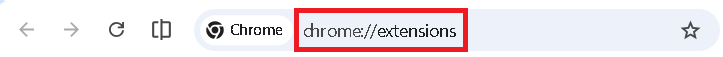

**3. デベロッパーモードをオンにする**

画面右上の「**デベロッパーモード**」のスイッチをオンにします。

> 📷 **画像が必要な箇所②**
> 拡張機能管理画面の右上にある「デベロッパーモード」トグルがオンになっている状態のスクリーンショット

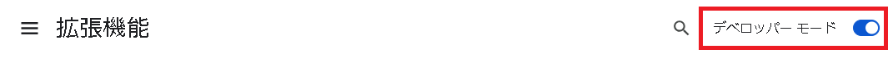

**4. フォルダを読み込む**

「**パッケージ化されていない拡張機能を読み込む**」ボタンをクリックし、手順1で保存した `meet_auto_joiner` フォルダを選択します。

> 📷 **画像が必要な箇所③**
> 「パッケージ化されていない拡張機能を読み込む」ボタンをクリックしてフォルダ選択ダイアログが開いている画面のスクリーンショット

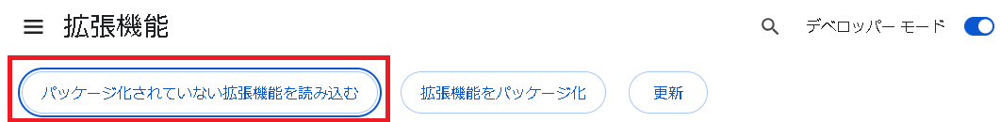

**5. インストール完了**

拡張機能の一覧に「**Meet Auto Joiner**」が表示されればインストール完了です。

> 📷 **画像が必要な箇所④**
> 拡張機能一覧に「Meet Auto Joiner v0.3.0」が表示されている状態のスクリーンショット

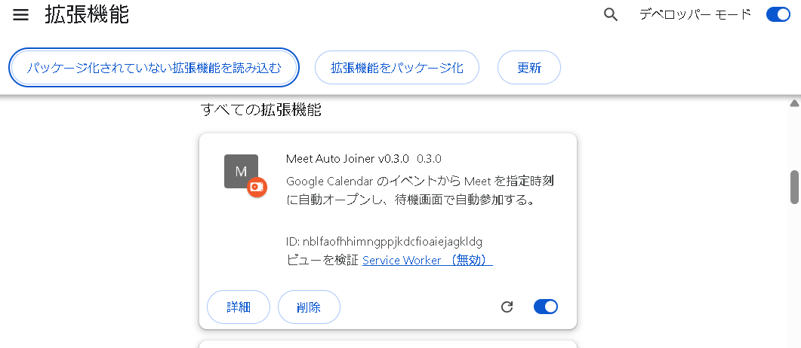

---

## 使い方

### カレンダーから自動オープンを設定する

**1. Google カレンダーで予定を開く**

[Google カレンダー](https://calendar.google.com) を開き、自動オープンを設定したい予定をクリックします。

> 📷 **画像が必要な箇所⑤**
> Google カレンダーで予定をクリックして詳細パネルが開いている状態のスクリーンショット

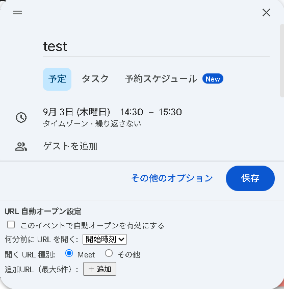

**2. 自動オープン設定パネルを確認する**

予定の詳細パネルの下部に「**URL 自動オープン設定**」という欄が表示されます。

> 📷 **画像が必要な箇所⑥**
> 予定詳細パネルの下部に「URL 自動オープン設定」欄が表示されているスクリーンショット（チェックボックス・時刻選択・URL種別ラジオボタン・追加URLセクションが見えている状態）

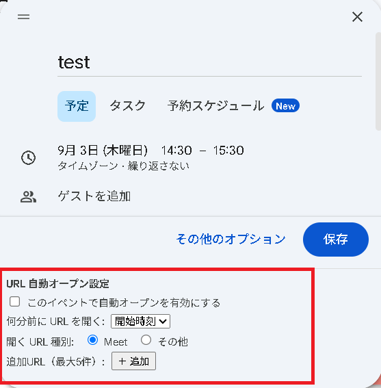

**3. 自動オープンを有効にする**

「**このイベントで自動オープンを有効にする**」のチェックボックスをオンにします。

**4. 開くタイミングを選ぶ**

「**何分前に URL を開く**」のプルダウンから、URLを開くタイミングを選びます。

| 選択肢 | 意味 |
|--------|------|
| 開始時刻 | 予定の開始時刻ちょうどに開く |
| 30秒前 | 開始の30秒前に開く |
| 1分前〜15分前 | 開始の指定分数前に開く |

**5. 開くURLの種別を選ぶ**

- **Meet** を選ぶと、予定に紐づいている Google Meet のURLが自動で使われます
- **その他** を選ぶと、テキストボックスが表示されるので、開きたいURL（ZoomやTeamsなど）を入力します

> 📷 **画像が必要な箇所⑦**
> 「その他」を選択してテキストボックスにURLを入力している状態のスクリーンショット

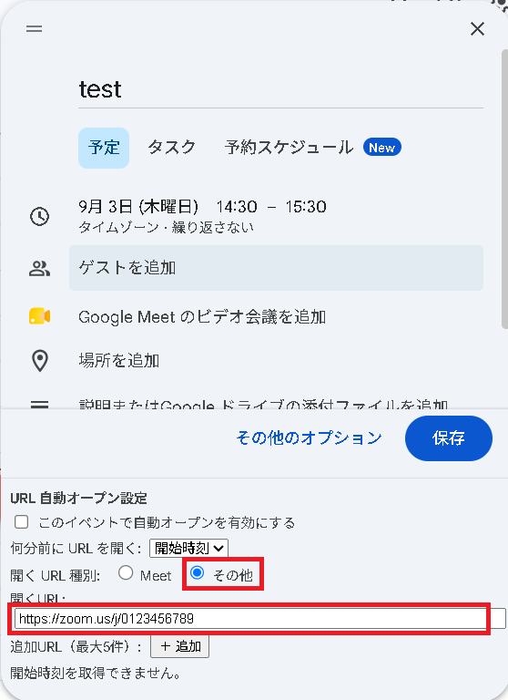

**6. 追加URLを登録する（任意）**

同じタイミングで複数のURLを開きたい場合は、「**＋ 追加**」ボタンをクリックします。
テキストボックスが追加されるので、開きたいURLを入力します。最大5件まで登録できます。

削除したい行は「**削除**」ボタンを押すと消えます。

> 📷 **画像が必要な箇所⑧**
> 追加URLの行が2〜3件表示されており、それぞれにURLが入力されている状態のスクリーンショット

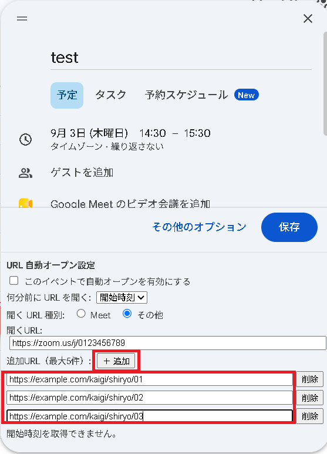

**7. 設定が保存される**

各項目を変更すると自動で保存されます。パネル下部に「**自動オープン設定を保存しました。**」と表示されれば設定完了です。

設定済みの予定にはカレンダー上に 🔔 マークが表示されます。

> 📷 **画像が必要な箇所⑨**
> カレンダーの予定タイルに🔔マークが表示されているスクリーンショット

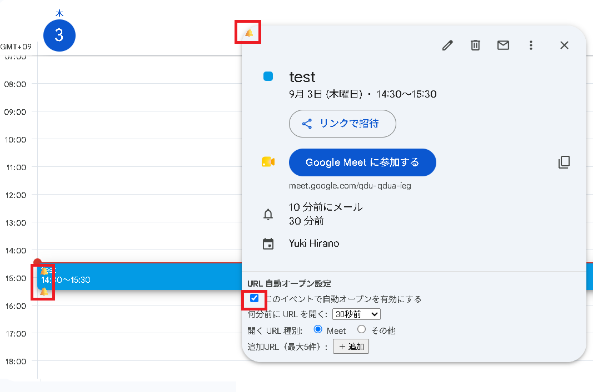

---

### Meet 画面での自動参加を使う

この機能は、Google Meet の待機画面を手動で開いたときに使います。
（カレンダーからの自動オープンと組み合わせると、開いて自動参加まで全自動にできます）

**1. Google Meet の待機画面を開く**

Meet のURLを開くと、画面右上に「**自動参加**」パネルが表示されます。

> 📷 **画像が必要な箇所⑩**
> Google Meet の待機画面の右上に「自動参加」パネルが表示されているスクリーンショット

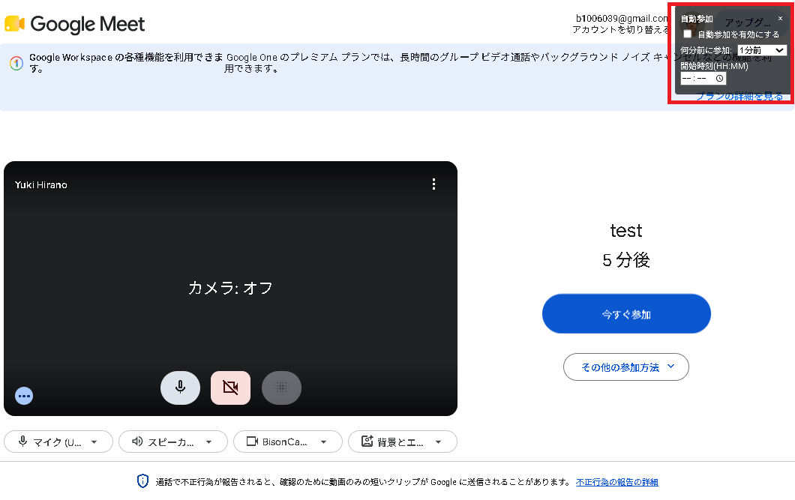

**2. 自動参加を設定する**

- 「**自動参加を有効にする**」をチェックします
- 「**何分前に参加**」で参加するタイミングを選びます
- 「**開始時刻(HH:MM)**」に会議の開始時刻を入力します

設定すると「自動参加予約: XX:XX に Join ボタンをクリック」と表示され、指定時刻になると自動で参加ボタンが押されます。

> 📷 **画像が必要な箇所⑪**
> 自動参加パネルにチェックが入り、時刻が設定されて「自動参加予約」のステータスが表示されているスクリーンショット

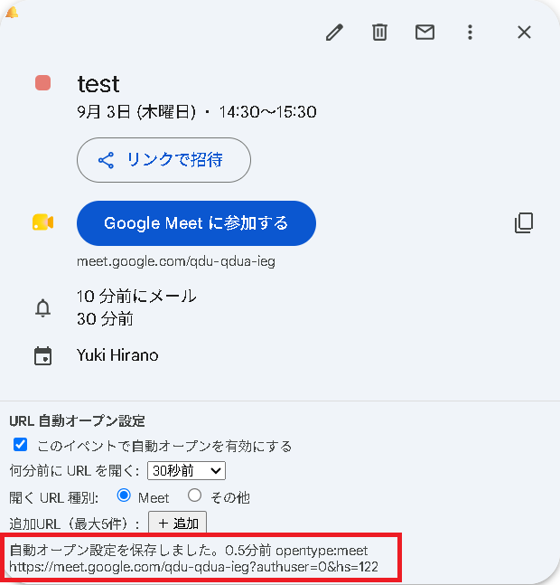

---

## よくある質問

**Q. 設定した時刻になってもURLが開かない**
- パソコンがスリープ状態だと動作しません。時刻前にスリープを解除しておいてください
- Chrome が起動していない場合も動作しません

**Q. カレンダーに「URL 自動オープン設定」が表示されない**
- ページを再読み込みしてから予定を開き直してください
- 拡張機能が有効になっているか `chrome://extensions` で確認してください

**Q. 拡張機能を更新したい**
- 新しい `meet_auto_joiner` フォルダで上書きした後、`chrome://extensions` を開き「Meet Auto Joiner」の更新ボタン（🔄）をクリックしてください
